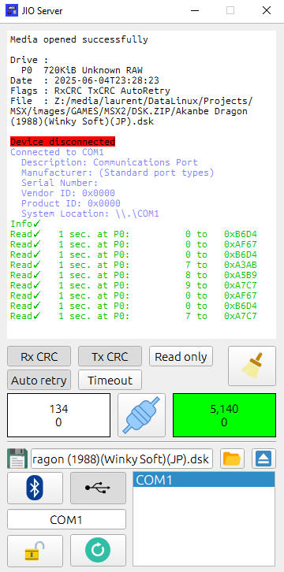
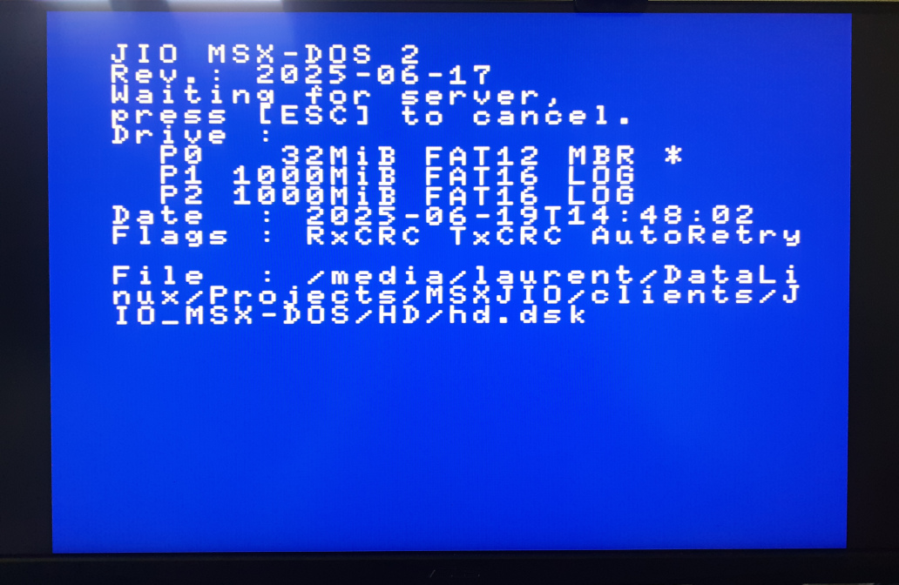
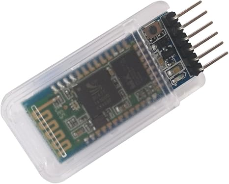
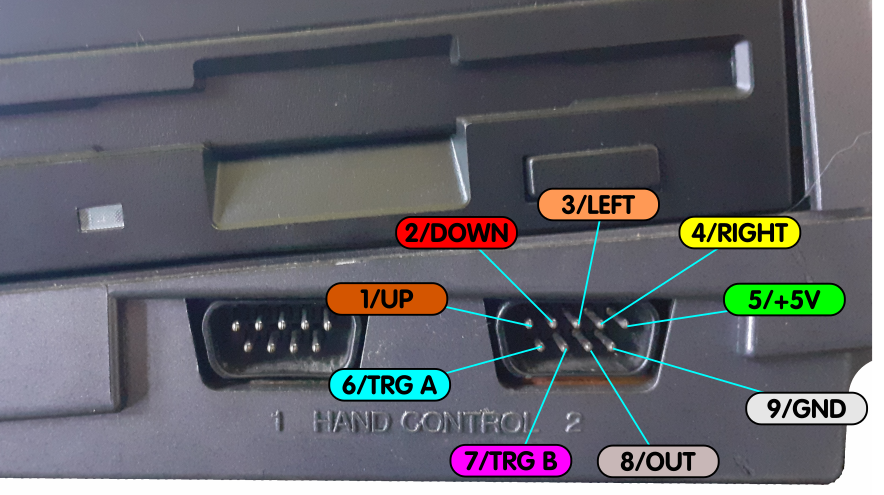
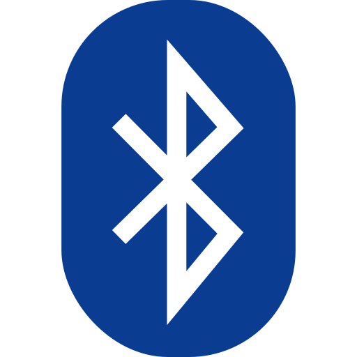
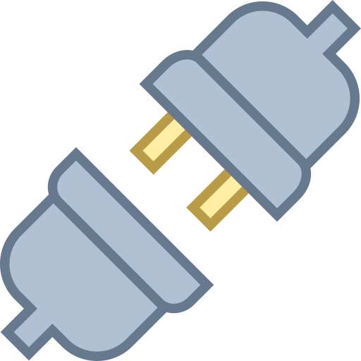
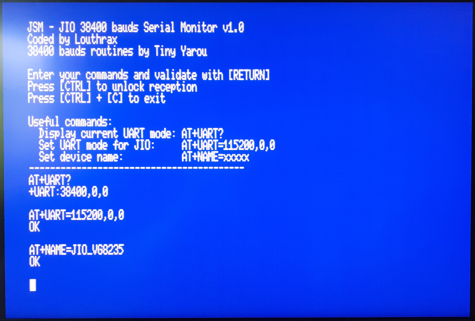
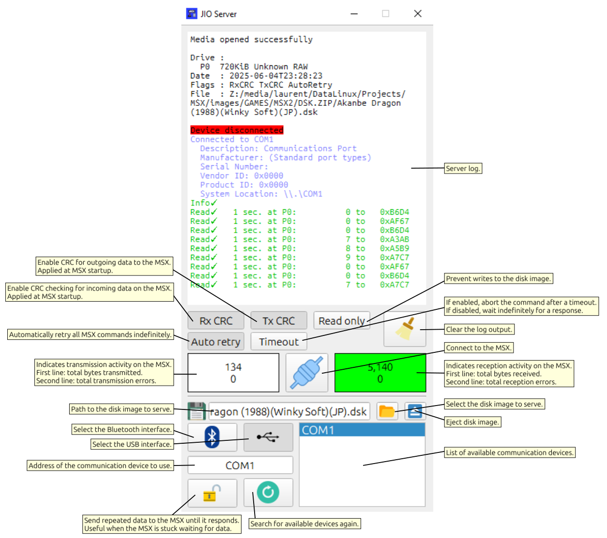
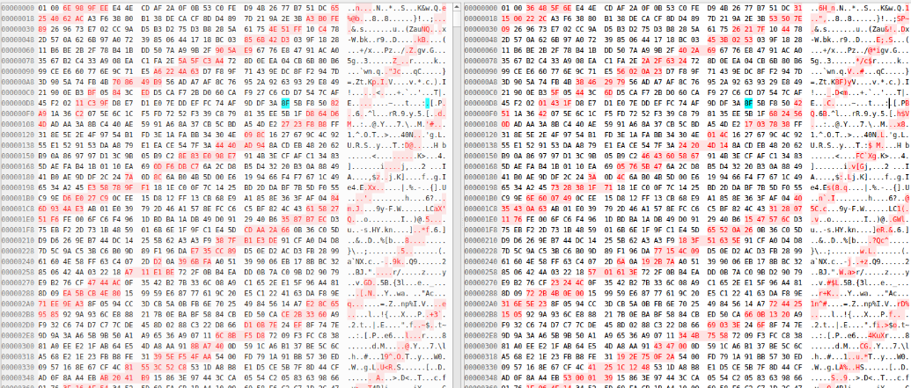

# MSXJIO

## Overview

**MSXJIO** is a project that allows serving a hard or floppy disk-image (and other things to come),
 from a host computer (or smartphone) to your MSX, through high-speed **115200 bauds** communication on joystick port 2.

 All you need is a cheap USB or Bluetooth communication chip, and a 16KB or 32KB ROM (for the MSX-DOS clients).

**JIO** stands for **J**oystick **I**nput **O**utput.

<table  align="center">
  <tr>
    <td align="center">
      
    </td>
    <td align="center">
      
    </td>
  </tr>
</table>

The system is divided into two parts:

- **JIOServer**: the server application, which runs on **Linux**, **Windows**, **macOS**, or **Android**.

- **MSX Clients**:
    - **JIO MSX-DOS 1**  
    A modified version of MSX-DOS 1 reading sectors from a served hard or floppy disk image

    - **JIO MSX-DOS 2**  
    A modified and compact version of MSX-DOS 2 reading sectors from a served hard or floppy disk image

    - **JSYNC** (not released yet)  
    An MSX-DOS 2 tool to synchronize files an directories between MSX and host (a bit like rsync).

    - **JRTC** (not released yet)  
    An MSX-DOS 2 tool to synchronize MSX RTC time and date with host.

Details about b3rendsh's MSX-DOS clients can be found here: https://github.com/b3rendsh/msxdos2s

There's also a **JSM** (JIO Serial Monitor) helper tool that you can use to configure your Bluetooth communication chip.

## Downloads
All server (Android, Linux, Windows and macOS) and client software can be downloaded [here](https://github.com/louthrax/MSXJIO/releases).

## Supported MSX models

As the signal decoding is done in a software way on MSX, the client MSX Z80 frequency needs to be as
close as possible from the "standard" one (3 579 545 Hz):  
- Models confirmed to be working:  

    | Model           | Frequency     |
    |----------------|----------------| 
    | VG-8235        | 3 554 367 Hz   |
    | HB-G900AP      | 3 578 959 Hz   |
    | VG-8020        | 3 579 200 Hz   |
    | Toshiba HX-10  | 3 579 367 Hz   |
    | Palcom PX-V60  | 3 579 431 Hz   |
    | VG-8010        | 3 579 545 Hz   |
    | HB-F700F       | 3 579 599 Hz   |
    | NMS 8255       | 3 579 617 Hz   |
    | turboR         | 3 579 617 Hz   |

- Models tested as non-working:

    | Model          | Frequency     |
    |----------------|---------------| 
    |National CF-3000|3 579 405 Hz   |
    |Casio PV-7      |3 579 431 Hz   |

Weirdly, the frequency of these models is close from the standard one, but there might be other
(electronical) factors here...

## Harware

JIOServer can communicate with the MSX through:

- **USB**, using a **USB to TTL UART adapter**

  

    
  

  Models confirmed to be working are:
  
    - FTDI USB UART IC FT232RL

- **Bluetooth**, using a **Bluetooth Serial Transceiver module**  
    

      
    
  
    Models confirmed to be working are:

    - HC-05
    - HC-06

⚠️ **Do NOT use standard RS-232 adapters**—they may output +12V/-12V, which can **damage your MSX**.

For both USB and Bluetooth, prefer the 5V versions, as the standard voltage on the MSX joystick port is 5V. Some models have jumpers to switch between different voltages (5V or 3.3V).

## Building the adapter Cable

- MSX Joystick Port 2, Pin 1 → Adapter **TX**  
- MSX Joystick Port 2, Pin 6 → Adapter **RX**  
- MSX Joystick Port 2, Pin 9 → Adapter **GND**  
- MSX Joystick Port 2, Pin 5 → Adapter **VCC**, ⚠️ only required for Bluetooth

    

  

## Usage Instructions for the MSX-DOS clients

1. Create an MSX-DOS 2 cartridge (or flash `JIO-MSXDOS2` to a MegaFlashROM or Carnivore2).
1. Connect your MSX to your PC using a USB serial cable or Bluetooth adapter.
1. Launch **JIOServer** and select the disk image to serve.
1. Select USB or Bluetooth mode using the  or   button
1. Select the communication device to use (ttyUSB0 or DSD TECH HC-05 for example)
1. Click the  button.
1. Boot your MSX.
1. You should see an Info✓  appear in the server log and the LED blink.
1. The MSX should now access the image.

## How to Create the 32KB JIO-MSXDOS2 Cartridge

*Instructions to be added.*

## Bluetooth Configuration for MSXJIO

1. Default password: `1234`
1. Plug the **HC-05** into the **Bluetooth** socket.
1. Plug the **FTDI FT232RL** into the **USB Cable** socket.
1. Hold the **AT** button on the HC-05.
1. While holding, plug the USB into your PC.
1. The HC-05 LED should blink **slowly** (~2s).
1. Launch the **DSD TECH Wireless Tools** utility.
1. Set UART port to e.g. `COM9`, Baud Rate to `38400`, and click **Open`.
1. You should now be able to send AT commands.
1. Configure for this project by sending:  
    `AT+UART=115200,1,0`

    

  

## Fun things to try with JIOMSX
- JIOMSX can serve openMSX hard disk images : code some stuff on openMSX, and immediately test them on a real MSX machine by just serving
the same disk image. No need to swap any SD card !
- Buy several Bluetooth adapters, and name them according to the MSX machine they are plugged in (JIO_VG_8238, JIO_turboR). To debug something on a specific
MSX machine, power it on, select the matching Bluetooth adapter on the server, and connect to test.
- A same disk image can be served to several MSX machines : start playing SD Snatcher on one MSX machine, and continue playing it on another one.

## History

All started with **NYYRIKKI**’s breakthrough **115200 bps** MSX serial communication routine, posted on January 3rd 2025 on msx.org:  
👉 https://www.msx.org/forum/msx-talk/development/software-rs-232-115200bps-on-msx

Shortly after, he released a working **MSX-DOS 1** version serving disk images with **drive sound emulation**!  
👉 https://www.youtube.com/watch?v=OHs5a-gZtuc  
Thats was crazy !

At the same time, I was aware of **b3rendsh**’s MSX-DOS 2 project:  
👉 https://github.com/b3rendsh/msxdos2s  
... which was compact (32KB only, and no need for mapper), and designed to easily integrate any hardware.

I told myself that combining NYYRIKKI’s 115200 bauds routine together with b3rendsh modular MSX-DOS could lead
to a very cheap, versatile and not so slow MSX-DOS 2 hard-disk server !

I quickly contacted b3rendsh, and we started working together on that project.

After several months of collaborative coding and debugging, we hopefuly reached a stable and usable first version !

## Server details
macOS, Windows and Linux versions of the server have tooltips for each UI componenents, which should be self-explanatory.

For Android (that provides not tooltip), here's a quick explanation view:

    

  

## Known Issues
Casio PV-7 and National CF3000 are showing these kind of corruptions on reception:

    

It works a bit better if adding a pull down resistor between MSX RX and GND, but there are still errors.

## Bug report
You can submit tickets on GitHub, or post messages on this thread:
https://www.msx.org/forum/msx-talk/development/msx-jio

## Credits
- Enhanced MSX DOS 2 and MSX DOS 1 versions, ideas, debugging, testing, help on JIOServer: **b3rendsh** (https://github.com/b3rendsh/msxdos2s)
- 115200 bauds MSX communication routine and originial Python server: **NYYRIKKI** (https://msx.fi/nyyrikki/software.html)
- Original 38400 bauds communication routine used by JIO Serial Monitor tool: **Tiny Yarou** (https://www.tiny-yarou.com/)
