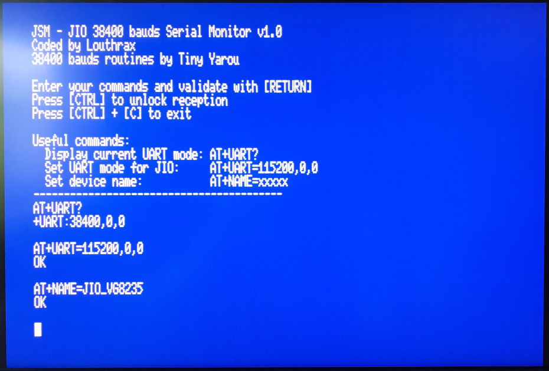

# MSXJIO

**MSXJIO** is a project that allows serving a hard or floppy disk image, or folders of the host computer (or
smartphone) as MSX-DOS drives, to your MSX, through high-speed **115200 bauds** communication on joystick port 2 (or
the JIO cartridge).

All you need is a cheap USB or Bluetooth communication chip, and a 16KB or 32KB ROM (for the MSX-DOS clients).

**JIO** stands for **J**oystick **I**nput **O**utput.

<p align="center">
  <a href="https://www.youtube.com/watch?v=NH9YH9l05ng">
    
  </a><br>
  Click on image to start video on YouTube
</p>

The system is divided into two parts:

- **JIOServer**: the server application, which runs on **Linux**, **Windows**, **macOS**, or **Android**.

- **MSX Clients**:
  - **JIO MSX-DOS 1** (ROM)  
  A modified version of MSX-DOS 1 reading sectors from a served hard or floppy disk image.

  - **JIO MSX-DOS 2** (ROM)  
  A modified and compact version of MSX-DOS 2. It reads sectors from a served disk image, or uses folders of the host
  as drives (see [Serving directories](#serving-directories)). The drives of your MSX (e.g. its floppy drive) stay
  available.

  - **JIO.COM**  
  Serves host folders as drives on an MSX that already runs MSX-DOS 2 or Nextor (from another cartridge), without the
  JIO ROM.

  - **JIO-ROM.COM**  
  Starts MSX-DOS 2 with the JIO MSX-DOS 2 ROM loaded in RAM, on an MSX2 that boots MSX-DOS 1 (e.g. from its floppy
  drive), without the JIO ROM (see [JIO-ROM.COM](#jio-romcom-msx-dos-2-on-an-msx-dos-1-computer-without-the-jio-rom)).

  - **JIOTIME.COM**  
  Sets the date and time of the MSX from the host.

Details about b3rendsh's MSX-DOS clients can be found here: https://github.com/b3rendsh/msxdos2s

There's also a **JSM** (JIO Serial Monitor) helper tool that you can use to configure your Bluetooth communication chip.

## Downloads

All server (Android, Linux, Windows and macOS) and client software can be downloaded [here](https://github.com/louthrax/MSXJIO/releases).

## Supported MSX models

As the signal decoding is done in a software way on MSX, the client MSX Z80 frequency needs to be as
close as possible to the "standard" one (3 579 545 Hz):  

- Models confirmed to be working:  

    | Model           | Frequency     |
    |----------------|----------------| 
    | VG-8235        | 3 554 367 Hz   |
    | HB-G900AP      | 3 578 959 Hz   |
    | VG-8020        | 3 579 200 Hz   |
    | Toshiba HX-10  | 3 579 367 Hz   |
    | Palcom PX-V60  | 3 579 431 Hz   |
    | VG-8010        | 3 579 545 Hz   |
    | HB-F700F       | 3 579 599 Hz   |
    | NMS 8255       | 3 579 617 Hz   |
    | turboR         | 3 579 617 Hz   |

- Models tested as non-working:

    | Model          | Frequency     |
    |----------------|---------------|
    |National CF-3000|3 579 405 Hz   |
    |Casio PV-7      |3 579 431 Hz   |

    Weirdly, the frequency of these models is close to the standard one, but there might be other
(electronical) factors here...

## Hardware

⚠️ **Do NOT use standard RS-232 adapters**—they may output +12V/-12V, which can **damage your MSX**.

JIOServer can communicate with the MSX through:

- **USB**, using a **USB to TTL UART adapter**

  <p align="center">
    
  </p>

  Models confirmed to be working are:
  - **FTDI USB UART IC FT232RL**: https://fr.aliexpress.com/item/4000641000474.html

- **Bluetooth**, using a **Bluetooth Serial Transceiver module**  
    <p align="center">
      
    </p>  

  Models confirmed to be working are:
  - **DSD TECH BT-05 Module**: https://www.amazon.fr/DSD-TECH-BT-05-classique-Bluetooth/dp/B09NKYV3D7

  Note: Avoid the BC41C-based models (small chip on the antenna side):
    <p align="center">
      
    </p>
    and favor the BC417-based ones (bigger chip):
    <p align="center">
      
    </p>


For both USB and Bluetooth, prefer the 5V versions when possible, as the standard voltage on the MSX joystick port is 5V. Some models have jumpers to switch between different voltages (5V or 3.3V).

## Connecting the adapter to joystick port 2

- MSX Joystick Port 2, Pin **1** → Adapter **TX**  
- MSX Joystick Port 2, Pin **6** → Adapter **RX**  
- MSX Joystick Port 2, Pin **9** → Adapter **GND**  
- MSX Joystick Port 2, Pin **5** → Adapter **VCC**, ⚠️ only required for Bluetooth

<p align="center">
    
</p>  

For those who are nervous about using a soldering iron, you can directly wire the adapter to the joystick port using Dupont cables (which are often sold with the adapter):

<p align="center">
    
</p>  

Of course, you can also build yourself something more handy like that:
<p align="center">
    
</p>  

## Bluetooth configuration for MSXJIO

It is very likely that the Bluetooth Serial Transceiver module you just bought is not configured to match the required MSXJIO settings:

|Setting   | Value             |
|----------|-------------------|
|Baud rate | **115200 bits/s** |
|Stop bit  | **1 bit**         |
|Parity    | **None**          |

For the **HC-05** chip, you can use the **JSM** tool (JIO Serial Monitor) provided by MSXJIO: `JIO_38400_bauds_serial_monitor_3_0.zip` in the [latest release](https://github.com/louthrax/MSXJIO/releases/latest).

- Plug your HC-05 module in MSX joystick port 2
- Power on your MSX **while keeping the HC-05 AT switch pressed**. The HC-05 led should be blinking in a stable and slowly (2s) way.
- Run JSM.BAS from MSX-BASIC
- Enter this command:  
  **AT+UART=115200,0,0**
- You can also change the name of your device with the command:  
  **AT+NAME=<name_here>**
  <p align="center">
      
  </p>
- A list of the available AT commands for the HC-05 is available [here](./docs/HC-03_05_AT_command_set.pdf).

Configuration of the **HC-06** is trickier and requires an extra USB to TTL UART adapter.  
Procedure is described [here](https://github.com/b3rendsh/msxdos2s/tree/main/jio/bluetooth).

## JIO cartridge and joystick port 1

The [JIO cartridge](https://github.com/herraa1/msx-jio-cart-v1) by herraa1 holds the ROM, the USB serial and/or
Bluetooth module, and an I/O register for the serial line: joystick port 2 stays free. You can also wire the adapter
to **joystick port 1** instead of port 2 (same pins).

**The serial line is found automatically.** While waiting for the server, the ROMs, JIO.COM and JIOTIME.COM try in
turn the JIO cartridge (at the I/O port set by its IOSEL switches: 00H, 20H or 30H), joystick port 2 and joystick
port 1, until the server answers. The line found is shown (the ROMs don't show joystick port 2, the default).

- To force a line with JIO.COM and JIOTIME.COM: `J1` or `J2` (joystick port), `C` (JIO cartridge, port detected) or
  `C00`, `C20`, `C30` (cartridge at this port), e.g. `JIO C +`, `JIOTIME J1`. `JIO S` shows the line in use.
- If your MSX has other devices at I/O ports 00H, 20H or 30H, use a **safe ROM** (`jio_dos2_safe.rom`,
  `jio_dos1_safe.rom`): it only tries the joystick ports and never writes to these ports.
- The cartridge's serial line still works when its ROM is disabled (ROMDIS switch): JIO.COM and JIOTIME.COM can use
  it while the MSX boots from another device.

## Which ROM to use

| ROM | Size | For |
|---|---|---|
| `jio_dos2.rom` | 32KB | MSX-DOS 2: disk images **and** directories |
| `jio_dos1.rom` | 16KB | MSX-DOS 1: disk images only |
| `jio_dos2_64k.rom`, `jio_dos1_64k.rom` | 64KB | the same ROM in a 64KB image, for flash cartridges that expect one (e.g. the JIO cartridge) |
| `jio_dos2_64k_NMS_8220.rom`, `jio_dos1_64k_NMS_8220.rom` | 64KB | to replace the internal ROM of a Philips NMS 8220 |
| `..._safe` versions | | same, without probing the JIO cartridge I/O ports (see above) |

Flash the ROM to the JIO cartridge, a MegaFlashROM or a Carnivore2, or burn it to an EPROM cartridge.

## Usage instructions for the MSX-DOS clients

1. Connect your MSX to your PC using a USB serial cable or Bluetooth adapter.
1. Launch **JIOServer**, choose what to serve (a disk image, or directories, see below).
1. Select USB or Bluetooth mode using the  or   button
1. Select the communication device to use (ttyUSB0 or DSD TECH HC-05 for example)
1. Click the  button.
1. Boot your MSX.
1. You should see an <span style="color:green">Info✓ </span> appear in the server log and the LED blink.
1. The MSX should now access the image or the directories.

The choice between disk image and directories is read by the ROM when the MSX starts: reset the MSX after changing it.

### Serving a disk image

The server serves a floppy or hard disk image (with partitions), read and written by sectors, as a real disk: works
with the MSX-DOS 1 and MSX-DOS 2 ROMs, boots from the image (MSX-DOS, or the boot sector of a game disk).

### Serving directories

With the MSX-DOS 2 ROM, the server can serve folders of the host as drives **A: to H:**: files are read and written
directly in these folders, no disk image to prepare. Copy files to the folder on your PC, they are immediately
visible on the MSX, and the other way round.

- Put `MSXDOS2.SYS` and `COMMAND2.COM` in the folder served as **A:**: the MSX boots from it.
- The drives of your MSX (e.g. its floppy drive) stay available, after the served drives.
- Long names of the host are shown as 8.3 names on the MSX (e.g. `LongFileName.text` → `LONGFI~1.TEX`), as MSX-DOS
  only knows 8.3 names. A long name typed on the MSX is kept as is on the host.
- `RAMDISK` creates the RAM disk **H:** on the server (a temporary folder, removed by a reset of the MSX).
- **Read only** option of the server: the served drives cannot be modified (the RAM disk stays writable).

### JIO.COM: directories without the JIO ROM

On an MSX that already boots MSX-DOS 2 or Nextor from another cartridge (with a memory mapper), JIO.COM adds the
directories served as drives, without the JIO ROM:

```
JIO +        ; install, and handle all the drives served by the server
JIO +D       ; handle drive D: only
JIO -D       ; stop handling drive D:
JIO S        ; show the drives handled and the serial line
JIO          ; help
```

Put `JIO +` in your `AUTOEXEC.BAT` to install it at each boot.

### JIO-ROM.COM: MSX-DOS 2 on an MSX-DOS 1 computer, without the JIO ROM

On an MSX2 that boots MSX-DOS 1 (e.g. from its internal floppy drive), JIO-ROM.COM starts MSX-DOS 2 with the JIO
MSX-DOS 2 ROM, loaded in RAM: no cartridge needed. The MSX is not reset: the ROM is copied to the memory mapper, then
MSX-DOS 2 starts as if the ROM was in a slot.

- Run `JIO-ROM` from MSX-DOS 1 (or put it in the `AUTOEXEC.BAT` of your MSX-DOS 1 floppy).
- The server serves directories as with the ROM: put `MSXDOS2.SYS` and `COMMAND2.COM` in the folder served as **A:**.
  The drives of the MSX (e.g. its floppy drive) come after the served drives. Disk images work too (MSX-DOS 2 boot).
- Needs a memory mapper of at least 128 KB in the RAM slot of pages 1 to 3 (e.g. Philips VG-8235, NMS 8255). The
  ROM uses its top 16 KB segment: MSX-DOS 2 shows 112 KB on a 128 KB MSX.
- A reset of the MSX comes back to MSX-DOS 1: put `JIO-ROM` in its `AUTOEXEC.BAT` to start MSX-DOS 2 again.
- Only the disk ROMs of the MSX are initialized again: an extension that set hooks at boot (other than a disk
  interface) does not set them again.
- The ROM loaded in RAM has no MSX-DOS 1 kernel entries: a disk image that boots MSX-DOS 1 (`MSXDOS.SYS`) does not
  boot with it (SofaRunIt can launch it from MSX-DOS 2).

### If the link is lost

If the server doesn't answer within about 5 seconds (server stopped, cable unplugged, Bluetooth out of range), the
MSX doesn't hang: the ROM shows a *Not ready* error (*Abort* gives an error to the program, *Retry* waits again), and
JIO.COM returns a *Not ready* error to the program.

On Bluetooth, the MSX automatically sends large writes in blocks, as some Bluetooth modules lose data on long
transfers.

## Fun things to try with JIOMSX

- JIOMSX can serve openMSX hard disk images: code some stuff on openMSX, and immediately test them on a real MSX machine by just serving
the same disk image. No need to swap any SD card !
- If you own an MSX with a built-in factory ROM (like  MSX Designer for the NMS 8220), simply reflash that ROM with JIO MSX-DOS 1 (16KB) or 2 (32KB) to save an external slot.
- Buy several Bluetooth adapters, and name them according to the MSX machine they are plugged in (JIO_VG_8238, JIO_turboR). To debug something on a specific
MSX machine, power it on, select the matching Bluetooth adapter on the server, and connect to test.
- A same disk image can be served to several MSX machines : start playing SD Snatcher on one MSX machine, and continue playing it on another one.
- Use your favorite disk system (floppy, sunrise, other) together with the MSX JIO interface.
You can use a mix of local drives and remote JIO server drives.
- Select a disk image with CP/M Plus for MSX2 and boot with the JIO MSX-DOS 1 ROM:
https://www.msx.org/downloads/bootable-hdd-image-of-cpm-31-for-beer-ide-interface
- Load an experimental romless DOS from tape on your MSX1/64K RAM and you're gone in sixty seconds:
https://github.com/b3rendsh/cxdos

Post your "fun things to try" experiences and suggestions on this [MRC thread](https://www.msx.org/forum/msx-talk/development/msxjio)

## History

All started with **NYYRIKKI**’s breakthrough **115200 bps** MSX serial communication routine, posted on January 3rd 2025 on msx.org:  
https://www.msx.org/forum/msx-talk/development/software-rs-232-115200bps-on-msx

Shortly after, he released a working **MSX-DOS 1** version serving disk images with **drive sound emulation**!  
https://www.youtube.com/watch?v=OHs5a-gZtuc  
That was crazy!

At the same time, I was aware of **b3rendsh**’s MSX-DOS 2 project:  
https://github.com/b3rendsh/msxdos2s  
... which was compact (32KB only, and no need for mapper), and designed to easily integrate any hardware.

I told myself that combining NYYRIKKI’s 115200 bauds routine together with b3rendsh modular MSX-DOS could lead
to a very cheap, versatile and not so slow MSX-DOS 2 hard-disk server !

I quickly contacted b3rendsh, and we started working together on that project.

After several months of collaborative coding and debugging, we hopefully reached a stable and usable first version !

## Server details

macOS, Windows and Linux versions of the server have tooltips for each UI component, which should be self-explanatory.

For Android (that provides no tooltips), here's a quick explanation view:
<p align="center">
    
</p>  

### Android

- The server asks for the **All files access** permission: it is needed to serve disk images and directories from
  the phone's storage.
- It also asks to show **notifications**: while connected to the MSX, a notification *JIO Server — Connected to the
  MSX* is shown, and the server keeps running when you switch to another application or when the phone locks itself.
  If the communication still stops when the phone is locked, set the battery usage of the application to
  *Unrestricted* in the settings of Android.

### Command line server

`JIOServerCLI` is a version of the server without user interface (included in the Windows installer and in the
macOS application bundle, separate archive for Linux). Everything is given by arguments, there are no settings and
no interaction once it is started. The connection is automatic: the serial port given, or the first USB serial
adapter found (FTDI first); it waits for the device if it is not present and reconnects after a disconnection.
Stop it with Ctrl+C. In the graphical server, the  button
copies to the clipboard (and shows in the log) the command line with its current configuration.

```
JIOServerCLI -i games.dsk                                 # serve a disk image
JIOServerCLI -d A=~/MSX/boot -d C=~/MSX/work -l jio.log   # serve directories as drives A: and C:, log file
JIOServerCLI -i hd.img -r -p /dev/ttyUSB1                 # read only, given serial port
JIOServerCLI -d ~/MSX/boot -b 98:D3:31:FB:12:34           # Bluetooth
JIOServerCLI --list                                       # serial ports (and the automatic choice)
```

| Option | |
|---|---|
| `-i`, `--image <file>` | serve a disk image (floppy, or hard disk with partitions) |
| `-d`, `--drive [X=]<dir>` | serve a directory as drive X: (A to H, next free drive without `X=`), can be repeated |
| `-r`, `--read-only` | refuse all writes (the RAM disk H: stays writable) |
| `--no-rx-crc`, `--no-tx-crc`, `--timeout`, `--slow-tx` | link options of the disk image mode (default: CRC both ways) |
| `--no-auto-retry` | the MSX does not retry the commands without answer (default: retry), disk image |
| `-p`, `--port <port>` | serial port (`ttyUSB0`, `/dev/ttyUSB0`, `/dev/serial/by-id/...`, `COM3`) |
| `-b`, `--bluetooth <address>` | Bluetooth device instead of a serial port (`--scan-bluetooth` lists them) |
| `-l`, `--log <file>` | also write the log to a file (appended) |
| `-q`, `--quiet`, `--brief`, `--no-color` | no log on the console, no details of the BDOS functions, no colours |

## Building and testing

Each project (`clients/JIO_MSX-DOS`, `clients/JIO_NFS`, `clients/JIO_TIME`, `tools/JSM`, `server`) has the same scripts:
`0_Build.sh` (or `0_Build_<platform>.sh` for the server), `0_Clean.sh`, and `0_Run.sh` for the clients run in
openMSX. The outputs go to the `0_Builds` folder of the project, the intermediate and generated files of the clients
and tools to its `0_Temp` folder. At the root:

```
./0_Build_All.sh             # all the clients and tools, then the servers of all the platforms
./0_Build_All.sh clients     # clients and tools only
./0_Test.sh                  # emulator tests of the MSX-DOS 2 ROM and of the clients (openMSX, mock server)
./0_Test.sh --real-server ~/bin/JIOServerCLI  # same with the real server (server/0_Install_CLI_Linux_Static.sh)
./0_Clean.sh                 # outputs and intermediate files of all the projects
```

Serial lines tried by the ROMs at boot: `JioPorts` in `clients/JIO_MSX-DOS/drv_jio.asm` (I/O ports of the JIO
cartridge, then joystick ports 2 and 1). The safe ROMs (`JIOSAFE` define) keep only the joystick ports.

## Known issues

Casio PV-7 and National CF3000 are showing these kind of corruptions on reception:
<p align="center">
    
</p>
It works a bit better if adding a pull down resistor between MSX RX and GND, but there are still errors.

## Bug report

You can submit tickets on GitHub directly [here](https://github.com/louthrax/MSXJIO/issues), or post messages on this [MRC thread](https://www.msx.org/forum/msx-talk/development/msxjio)

## Credits

- Enhanced MSX-DOS 2 and MSX-DOS 1 versions, ideas, debugging, testing, documentation, help on JIOServer: **b3rendsh**  
(https://github.com/b3rendsh/msxdos2s)

- 115200 bauds MSX communication routine, original Python server, support and ideas: **NYYRIKKI**  
(https://msx.fi/nyyrikki/software.html)

- Original 38400 bauds communication routine used by JIO Serial Monitor tool: **Tiny Yarou**  
(https://www.tiny-yarou.com/)


## Thanks to...

- Jipe for fixing my NMS 8220 used at Nijmegen's 2025 demo.

## Technical details

- [MSXJIO protocol specification](./msxjio_protocol_specification.md)
- [Supported Linux distributions](./supported_linux_distributions.md)

## License

This project is licensed under the terms of the **Attribution-NonCommercial-ShareAlike 4.0 International** license.

The license applies to the JIO protocol, JIO server and JIO specific code in the MSX clients and tools in this repository.
For material that contains substantial parts of work by others, the origins are mentioned in the source code and the copyright is respected when applicable.
