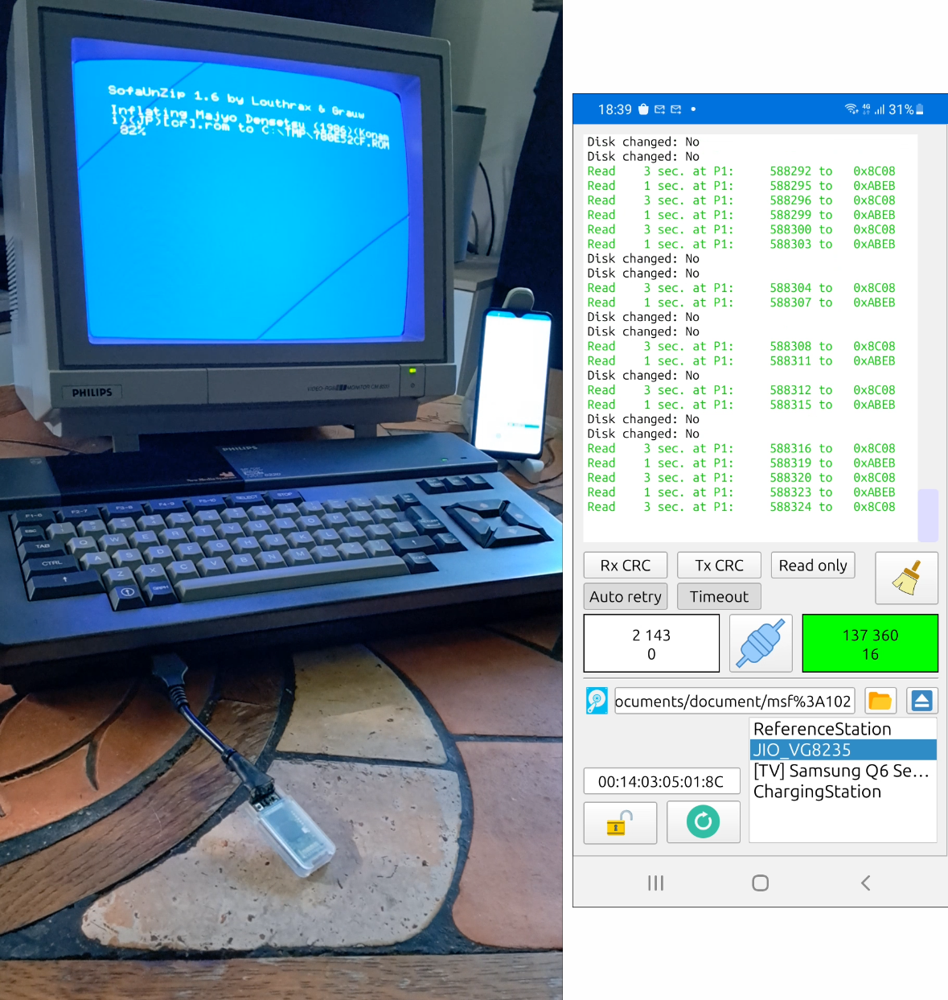
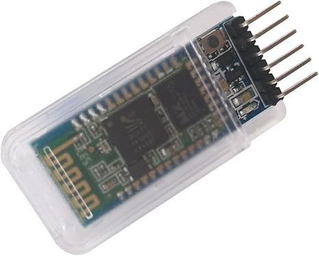
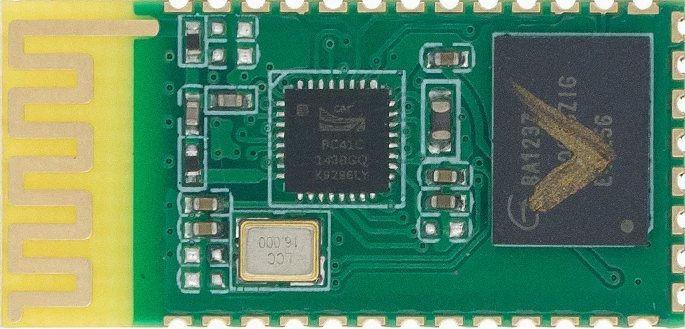
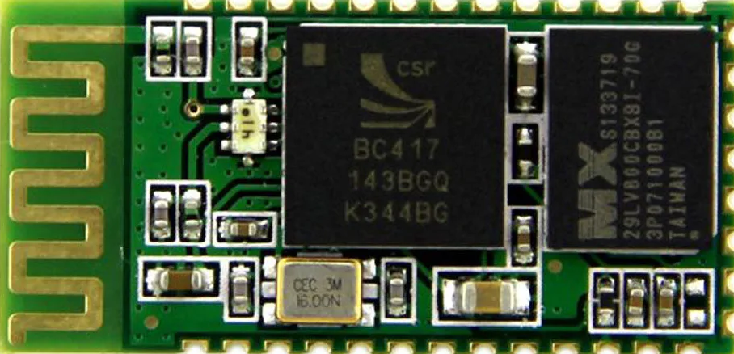
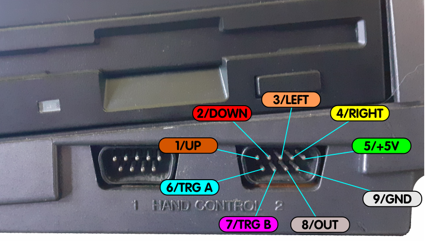
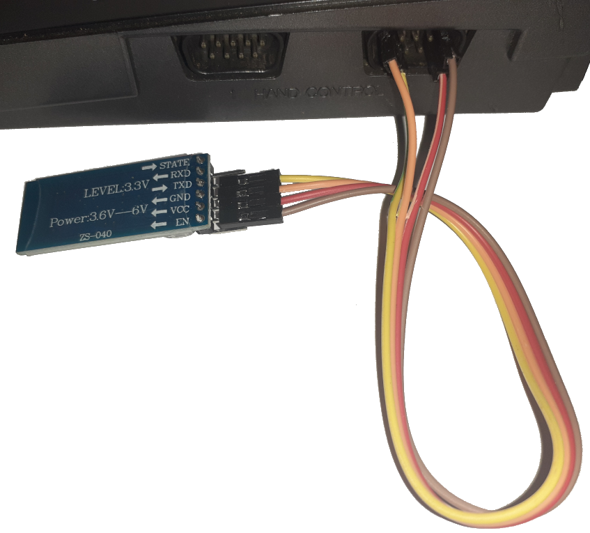
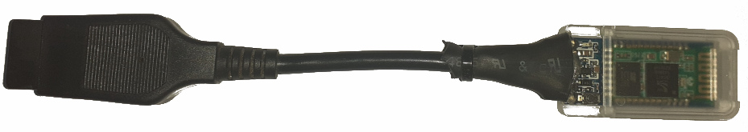
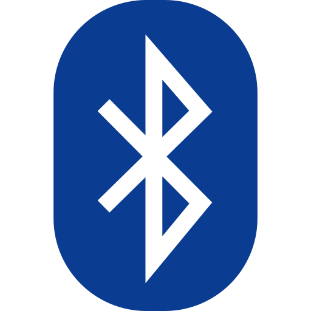
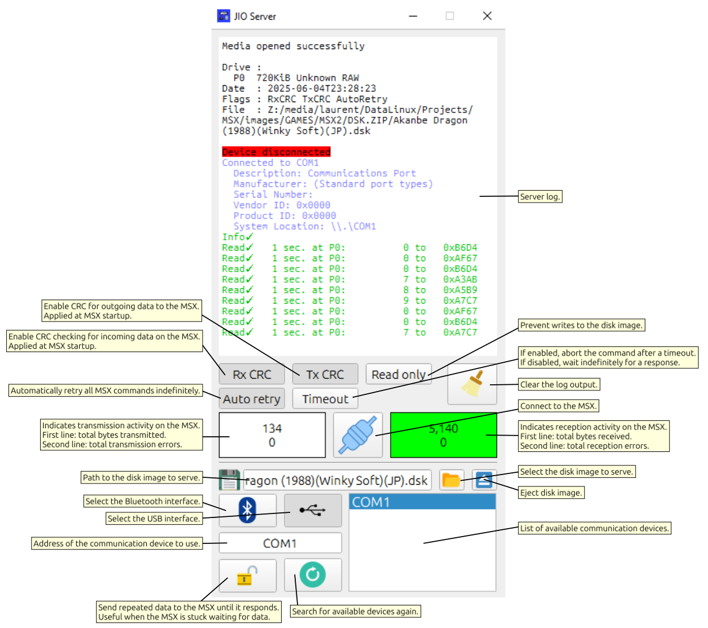
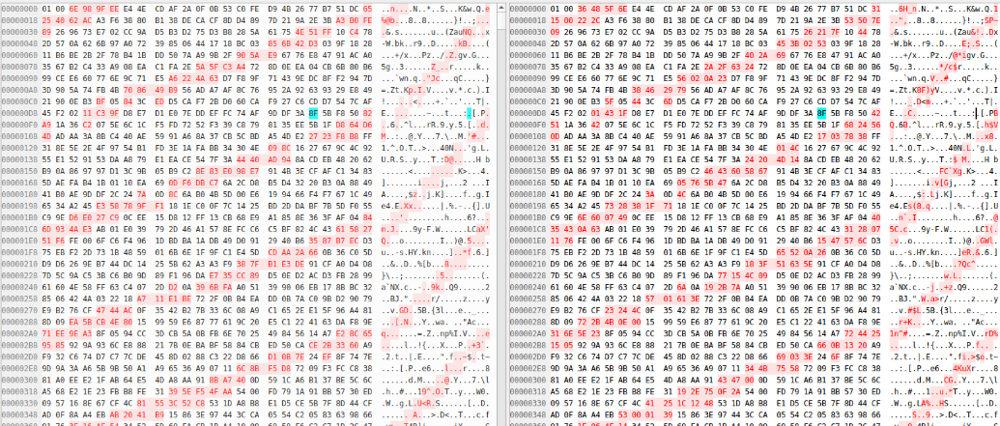

# MSXJIO

**MSXJIO** is a project that allows serving a hard or floppy disk-image (and other things to come),
 from a host computer (or smartphone) to your MSX, through high-speed **115200 bauds** communication on joystick port 2.

 All you need is a cheap USB or Bluetooth communication chip, and a 16KB or 32KB ROM (for the MSX-DOS clients).

**JIO** stands for **J**oystick **I**nput **O**utput.

<p align="center">
  <a href="https://www.youtube.com/watch?v=NH9YH9l05ng">
    
  </a><br>
  Click on image to start video on YouTube
</p>

The system is divided into two parts:

- **JIOServer**: the server application, which runs on **Linux**, **Windows**, **macOS**, or **Android**.

- **MSX Clients**:
  - **JIO MSX-DOS 1**  
  A modified version of MSX-DOS 1 reading sectors from a served hard or floppy disk image

  - **JIO MSX-DOS 2**  
  A modified and compact version of MSX-DOS 2 reading sectors from a served hard or floppy disk image

  - **JSYNC** (not released yet)  
  An MSX-DOS 2 tool to synchronize files an directories between MSX and host (a bit like rsync).

  - **JRTC** (not released yet)  
  An MSX-DOS 2 tool to synchronize MSX RTC time and date with host.

Details about b3rendsh's MSX-DOS clients can be found here: https://github.com/b3rendsh/msxdos2s

There's also a **JSM** (JIO Serial Monitor) helper tool that you can use to configure your Bluetooth communication chip.

## Downloads

All server (Android, Linux, Windows and macOS) and client software can be downloaded [here](https://github.com/louthrax/MSXJIO/releases).

## Supported MSX models

As the signal decoding is done in a software way on MSX, the client MSX Z80 frequency needs to be as
close as possible from the "standard" one (3 579 545 Hz):  

- Models confirmed to be working:  

    | Model           | Frequency     |
    |----------------|----------------| 
    | VG-8235        | 3 554 367 Hz   |
    | HB-G900AP      | 3 578 959 Hz   |
    | VG-8020        | 3 579 200 Hz   |
    | Toshiba HX-10  | 3 579 367 Hz   |
    | Palcom PX-V60  | 3 579 431 Hz   |
    | VG-8010        | 3 579 545 Hz   |
    | HB-F700F       | 3 579 599 Hz   |
    | NMS 8255       | 3 579 617 Hz   |
    | turboR         | 3 579 617 Hz   |

- Models tested as non-working:

    | Model          | Frequency     |
    |----------------|---------------|
    |National CF-3000|3 579 405 Hz   |
    |Casio PV-7      |3 579 431 Hz   |

    Weirdly, the frequency of these models is close from the standard one, but there might be other
(electronical) factors here...

## Hardware

⚠️ **Do NOT use standard RS-232 adapters**—they may output +12V/-12V, which can **damage your MSX**.

JIOServer can communicate with the MSX through:

- **USB**, using a **USB to TTL UART adapter**

  <p align="center">
    
  </p>

  Models confirmed to be working are:
  - **FTDI USB UART IC FT232RL**: https://fr.aliexpress.com/item/4000641000474.html

- **Bluetooth**, using a **Bluetooth Serial Transceiver module**  
    <p align="center">
      
    </p>  

  Models confirmed to be working are:
  - **DSD TECH BT-05 Module**: https://www.amazon.fr/DSD-TECH-BT-05-classique-Bluetooth/dp/B09NKYV3D7

  Note: Avoid the BC41C-based models (small chip on the antenna side):
    <p align="center">
      
    </p>
    and favor the BC417-based ones (bigger chip):
    <p align="center">
      
    </p>


For both USB and Bluetooth, prefer the 5V versions when possible, as the standard voltage on the MSX joystick port is 5V. Some models have jumpers to switch between different voltages (5V or 3.3V).

## Connecting the adapter to joystick port 2

- MSX Joystick Port 2, Pin **1** → Adapter **TX**  
- MSX Joystick Port 2, Pin **6** → Adapter **RX**  
- MSX Joystick Port 2, Pin **9** → Adapter **GND**  
- MSX Joystick Port 2, Pin **5** → Adapter **VCC**, ⚠️ only required for Bluetooth

<p align="center">
    
</p>  

For those who are nervous about using a soldering iron, you can directly wire the adapter to the joystick port using Dupont cables (which are often sold with the adapter):

<p align="center">
    
</p>  

Of course, you can also build yourself something more handy like that:
<p align="center">
    
</p>  

## JIO cartridge and joystick port 1

The [JIO cartridge](https://github.com/herraa1/msx-jio-cart-v1) by herraa1 has the ROM, the USB serial and/or
Bluetooth module, and an I/O register for the serial line: joystick port 2 stays free.
- ROMs: `jio_dos2.rom` (or `jio_dos1.rom`): while waiting for the server, they try in turn the JIO cartridge (I/O
  ports 00H, 20H, 30H of the IOSEL switches, used only if the cartridge is found there), joystick port 2 and joystick
  port 1. The line of the server is kept and shown at boot (except joystick port 2). `jio_dos2_safe.rom` (or
  `jio_dos1_safe.rom`): joystick ports only, no I/O port written to probe the cartridge (for an MSX with other
  devices at these ports).
- JIO.COM and JIOTIME.COM: option `C` (port detected) or `C<port>` (hex: `C00`, `C20`, `C30`), e.g. `JIO C +`,
  `JIOTIME C`. `JIO S` shows the serial line of the installed driver.
- JIO.COM (at install) and JIOTIME.COM without `J1`, `J2` or `C` option: JIO cartridge (if found), then joystick
  port 2, then joystick port 1, until the server answers; the serial line used is shown (JIO.COM keeps it).
- The I/O register works whatever the position of the ROMDIS switch (it only disables the flash ROM): with the ROM
  disabled, JIO.COM and JIOTIME.COM can use the cartridge from another boot device.

Joystick port 1 (the adapter wired as for port 2, on port 1): found automatically, or option `J1` of JIO.COM and
JIOTIME.COM (`J2`: port 2).

Serial lines of the ROMs: `JioPorts` in `clients/JIO_MSX-DOS/drv_jio.asm` (I/O ports of the JIO cartridge, probed,
then joystick ports 2 and 1), tried in turn at boot until the server answers; the safe ROMs (`JIOSAFE`) keep only the
joystick ports.

## Usage instructions for the MSX-DOS clients

1. Create an MSX-DOS 2 cartridge (or flash `JIO-MSXDOS2` to a MegaFlashROM or Carnivore2).
1. Connect your MSX to your PC using a USB serial cable or Bluetooth adapter.
1. Launch **JIOServer** and select the disk image to serve.
1. Select USB or Bluetooth mode using the  or   button
1. Select the communication device to use (ttyUSB0 or DSD TECH HC-05 for example)
1. Click the  button.
1. Boot your MSX.
1. You should see an <span style="color:green">Info✓ </span> appear in the server log and the LED blink.
1. The MSX should now access the image.

## Fun things to try with JIOMSX

- JIOMSX can serve openMSX hard disk images: code some stuff on openMSX, and immediately test them on a real MSX machine by just serving
the same disk image. No need to swap any SD card !
- If you own an MSX with a built-in factory ROM (like  MSX Designer for the NMS 8220), simply reflash that ROM with JIO MSX-DOS 1 (16KB) or 2 (32KB) to save an external slot.
- Buy several Bluetooth adapters, and name them according to the MSX machine they are plugged in (JIO_VG_8238, JIO_turboR). To debug something on a specific
MSX machine, power it on, select the matching Bluetooth adapter on the server, and connect to test.
- A same disk image can be served to several MSX machines : start playing SD Snatcher on one MSX machine, and continue playing it on another one.
- Use your favorite disk system (floppy, sunrise, other) together with the MSX JIO interface.
You can use a mix of local drives and remote JIO server drives.
- Select a disk image with CP/M Plus for MSX2 and boot with the JIO MSX-DOS 1 ROM:
https://www.msx.org/downloads/bootable-hdd-image-of-cpm-31-for-beer-ide-interface
- Load an experimental romless DOS from tape on your MSX1/64K RAM and you're gone in sixty seconds:
https://github.com/b3rendsh/cxdos

Post your "fun things to try" experiences and suggestions on this [MRC thread](https://www.msx.org/forum/msx-talk/development/msxjio)

## History

All started with **NYYRIKKI**’s breakthrough **115200 bps** MSX serial communication routine, posted on January 3rd 2025 on msx.org:  
https://www.msx.org/forum/msx-talk/development/software-rs-232-115200bps-on-msx

Shortly after, he released a working **MSX-DOS 1** version serving disk images with **drive sound emulation**!  
https://www.youtube.com/watch?v=OHs5a-gZtuc  
Thats was crazy !

At the same time, I was aware of **b3rendsh**’s MSX-DOS 2 project:  
https://github.com/b3rendsh/msxdos2s  
... which was compact (32KB only, and no need for mapper), and designed to easily integrate any hardware.

I told myself that combining NYYRIKKI’s 115200 bauds routine together with b3rendsh modular MSX-DOS could lead
to a very cheap, versatile and not so slow MSX-DOS 2 hard-disk server !

I quickly contacted b3rendsh, and we started working together on that project.

After several months of collaborative coding and debugging, we hopefuly reached a stable and usable first version !

## Server details

macOS, Windows and Linux versions of the server have tooltips for each UI componenents, which should be self-explanatory.

For Android (that provides not tooltips), here's a quick explanation view:
<p align="center">
    
</p>  

### Command line server

`JIOServerCLI` is a version of the server without user interface (included in the Windows installer and in the
macOS application bundle, separate archive for Linux). Everything is given by arguments, there are no settings and
no interaction once it is started. The connection is automatic: the serial port given, or the first USB serial
adapter found (FTDI first); it waits for the device if it is not present and reconnects after a disconnection.
Stop it with Ctrl+C. In the graphical server, the  button
copies to the clipboard (and shows in the log) the command line with its current configuration.

```
JIOServerCLI -i games.dsk                                 # serve a disk image
JIOServerCLI -d A=~/MSX/boot -d C=~/MSX/work -l jio.log   # serve directories as drives A: and C:, log file
JIOServerCLI -i hd.img -r -p /dev/ttyUSB1                 # read only, given serial port
JIOServerCLI -d ~/MSX/boot -b 98:D3:31:FB:12:34           # Bluetooth
JIOServerCLI --list                                       # serial ports (and the automatic choice)
```

| Option | |
|---|---|
| `-i`, `--image <file>` | serve a disk image (floppy, or hard disk with partitions) |
| `-d`, `--drive [X=]<dir>` | serve a directory as drive X: (A to H, next free drive without `X=`), can be repeated |
| `-r`, `--read-only` | refuse all writes (the RAM disk H: stays writable) |
| `--no-rx-crc`, `--no-tx-crc`, `--timeout`, `--slow-tx` | link options of the disk image mode (default: CRC both ways) |
| `--no-auto-retry` | the MSX does not retry the commands without answer (default: retry), disk image |
| `-p`, `--port <port>` | serial port (`ttyUSB0`, `/dev/ttyUSB0`, `/dev/serial/by-id/...`, `COM3`) |
| `-b`, `--bluetooth <address>` | Bluetooth device instead of a serial port (`--scan-bluetooth` lists them) |
| `-l`, `--log <file>` | also write the log to a file (appended) |
| `-q`, `--quiet`, `--brief`, `--no-color` | no log on the console, no details of the BDOS functions, no colours |

## Building and testing

Each project (`clients/JIO_MSX-DOS`, `clients/JIO_NFS`, `clients/JIO_TIME`, `tools/JSM`, `server`) has the same scripts:
`0_Build.sh` (or `0_Build_<platform>.sh` for the server), `0_Clean.sh`, and `0_Run.sh` for the clients run in
openMSX. The outputs go to the `0_Builds` folder of the project, the intermediate and generated files of the clients
and tools to its `0_Temp` folder. At the root:

```
./0_Build_All.sh             # all the clients and tools, then the servers of all the platforms
./0_Build_All.sh clients     # clients and tools only
./0_Test.sh                  # emulator tests of the MSX-DOS 2 ROM and of the clients (openMSX, mock server)
./0_Test.sh --real-server ~/bin/JIOServerCLI  # same with the real server (server/0_Install_CLI_Linux_Static.sh)
./0_Clean.sh                 # outputs and intermediate files of all the projects
```

## Known issues

Casio PV-7 and National CF3000 are showing these kind of corruptions on reception:
<p align="center">
    
</p>
It works a bit better if adding a pull down resistor between MSX RX and GND, but there are still errors.

## Bug report

You can submit tickets on GitHub directly [here](https://github.com/louthrax/MSXJIO/issues), or post messages on this [MRC thread](https://www.msx.org/forum/msx-talk/development/msxjio)

## Credits

- Enhanced MSX-DOS 2 and MSX-DOS 1 versions, ideas, debugging, testing, documentation, help on JIOServer: **b3rendsh**  
(https://github.com/b3rendsh/msxdos2s)

- 115200 bauds MSX communication routine, originial Python server, support and ideas: **NYYRIKKI**  
(https://msx.fi/nyyrikki/software.html)

- Original 38400 bauds communication routine used by JIO Serial Monitor tool: **Tiny Yarou**  
(https://www.tiny-yarou.com/)


## Thanks to...

- Jipe for fixing my NMS 8220 used at Nijmegen's 2025 demo.

## Technical details

- [MSXJIO protocol specification](./msxjio_protocol_specification.md)
- [Supported Linux distributions](./supported_linux_distributions.md)

## License

This project is licensed under the terms of the **Attribution-NonCommercial-ShareAlike 4.0 International** license.

The license applies to the JIO protocol, JIO server and JIO specific code in the MSX clients and tools in this repository.
For material that contains substantial parts of work by others, the origins are mentioned in the source code and the copyright is respected when applicable.
